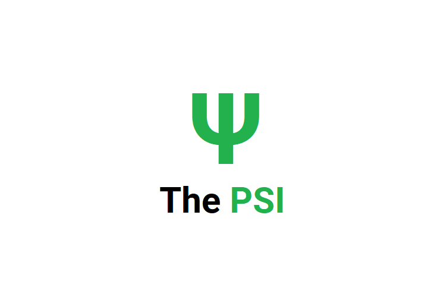

# The PSI
The PSI Swiping Interface is a device that allows the user to view the 24 hour Pollutant Standard Index of various parts of Singapore through gestures.

> Powered with ESP32, 1.44" TFT LCD screen & APDS9960 sensor.

